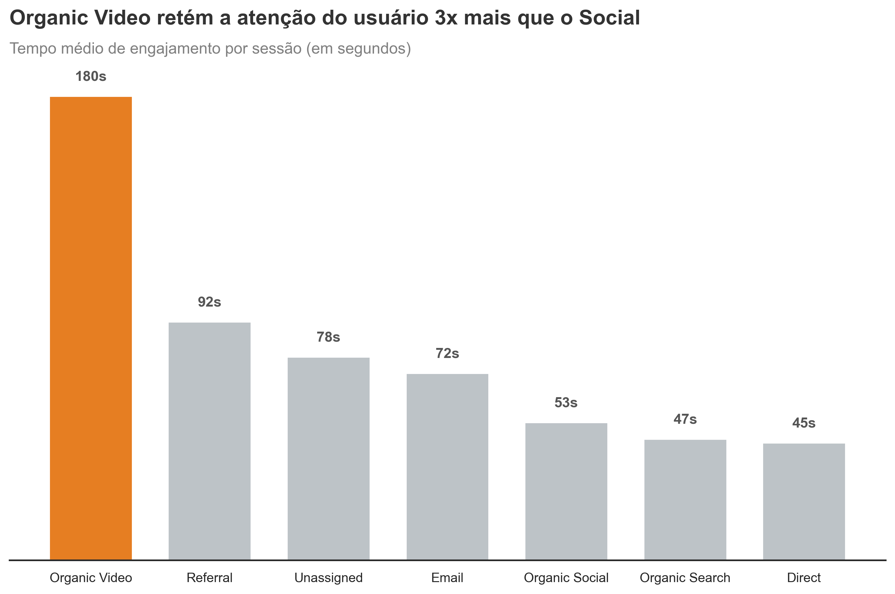
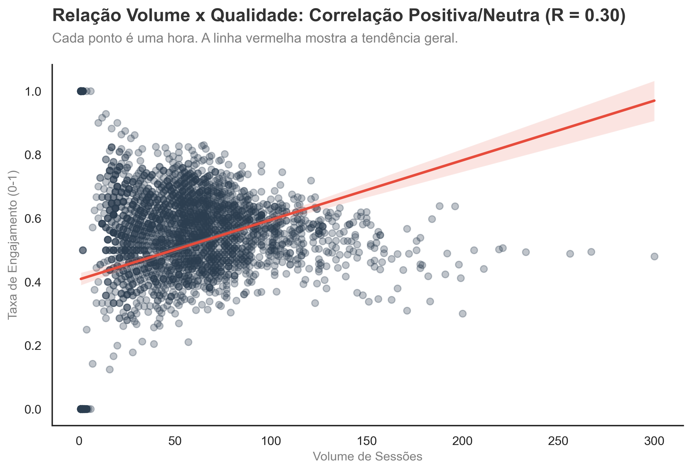
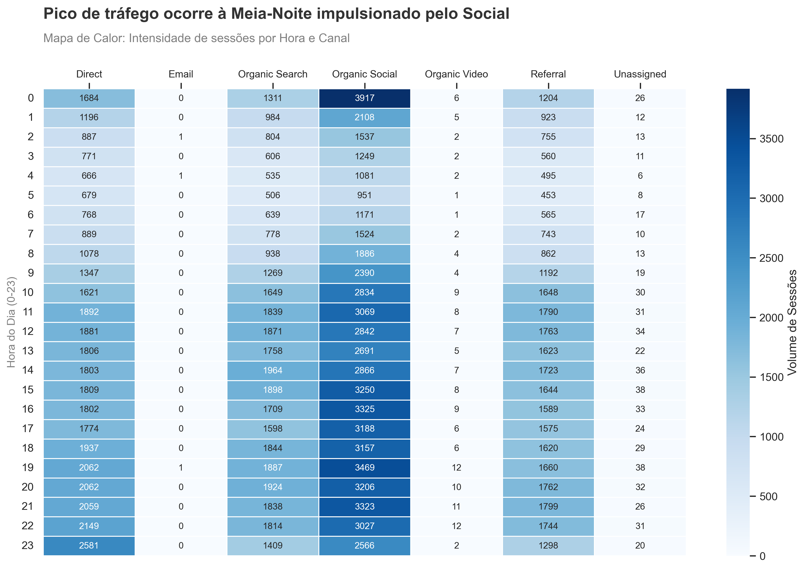

# 📊 Website Traffic & Engagement Analysis

## 📌 Introdução
Este projeto consiste em uma análise exploratória de dados (EDA) focada em **Marketing Digital e Comportamento do Usuário**. 

O objetivo principal é entender não apenas o volume de tráfego de um site, mas a **qualidade** desse tráfego. Através da manipulação de dados brutos, buscamos responder perguntas cruciais de negócio: *Qual canal traz mais usuários? Quem retém mais a atenção? Qual o melhor horário para postar conteúdo?*

> **Nota:** Este projeto foi desenvolvido como prática de análise de dados com Python, baseando-se no case "Website Data Analysis" do canal *The iScale*, com personalizações e análises estratégicas adicionais focadas em Business Intelligence.

---

## 💼 Contexto do Negócio
Imagine uma empresa que investe pesado em diversos canais de marketing (Redes Sociais, Google, E-mail, Vídeos), mas não tem clareza sobre o retorno real desses investimentos.

O problema central é a **"Ilusão do Volume"**:
* Muitos gestores olham apenas para o número de visitas (Sessões).
* Porém, visitas que não geram engajamento (usuários que entram e saem em segundos) são custos, não lucros.

**O desafio:** Transformar uma tabela bruta de logs de acesso (com datas, horas e categorias) em insights acionáveis para otimizar a estratégia de conteúdo, focando em reter o usuário e não apenas atraí-lo.

---

## 🛠️ Metodologia e Ferramentas
Para resolver esse problema, foi utilizado o ecossistema Python para Ciência de Dados. O fluxo de trabalho seguiu as etapas de um projeto real de Analytics:

1.  **Coleta e Carregamento (ETL):** Importação de dados brutos em formato `.csv`.
2.  **Limpeza de Dados (Data Cleaning):**
    * Tratamento de cabeçalhos inconsistentes.
    * Conversão de tipos de dados (Casting) para `datetime` e `float`.
    * Remoção de valores nulos e dados irrelevantes.
3.  **Engenharia de Atributos (Feature Engineering):**
    * Extração da hora do dia (`Hour`) a partir do timestamp completo para análise de sazonalidade horária.
    * Criação da métrica de "Sessões Não Engajadas" para comparação de qualidade.
4.  **Análise Exploratória (EDA):**
    * Análise de Séries Temporais (Tendências diárias).
    * Comparação categórica entre canais de aquisição.
    * Análise de Correlação com Mapas de Calor (Heatmaps).

**Tech Stack:**
* **Python:** Linguagem base.
* **Pandas:** Manipulação e agregação de dados.
* **Matplotlib & Seaborn:** Visualização de dados estática e estatística.

---

## 🔍 Principais Insights de Negócio

### 1. Qualidade vs. Quantidade
Descobrimos que, embora as Redes Sociais tragam volume, o **Organic Video** retém a atenção do usuário **3x mais**.

### 2. O Mito da "Diluição de Qualidade"
Nossa análise estatística (`Pearson R=0.31`) provou que **aumentar o tráfego NÃO reduz a qualidade**. Horários de pico trazem usuários altamente engajados, validando o investimento em escala.

### 3. Sazonalidade e Timing
O "horário nobre" do site é surpreendente: picos de acesso ocorrem à **Meia-Noite**, sugerindo um comportamento noturno do público-alvo.

---

## 🚀 Acesse o Projeto Completo

Quer ver o código passo a passo, a limpeza dos dados e a geração dos gráficos? Clique no botão abaixo para acessar o Notebook.

*(Caso o botão não funcione, navegue até o arquivo `.ipynb` na lista de arquivos acima)*